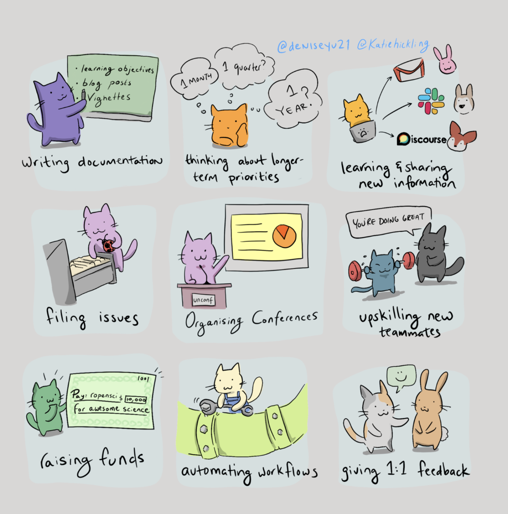
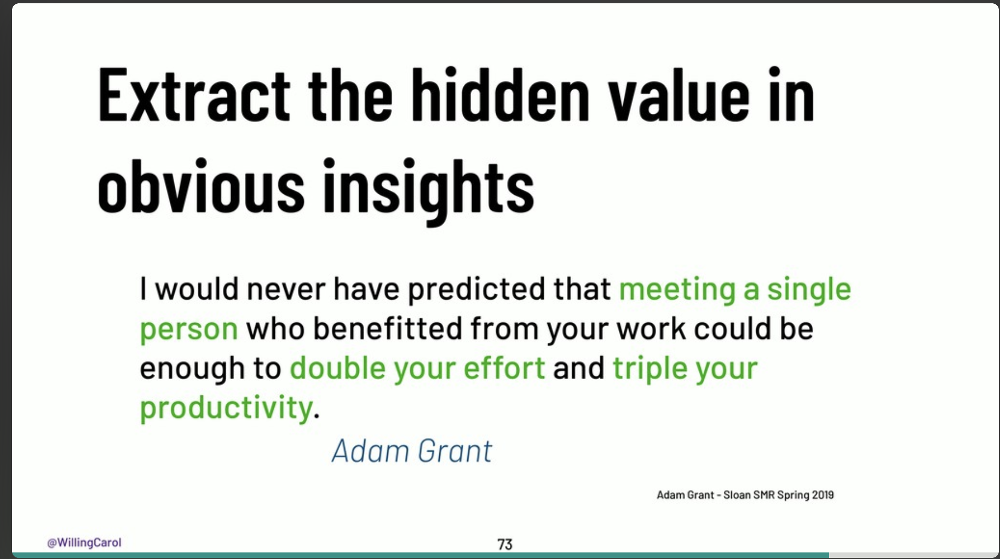
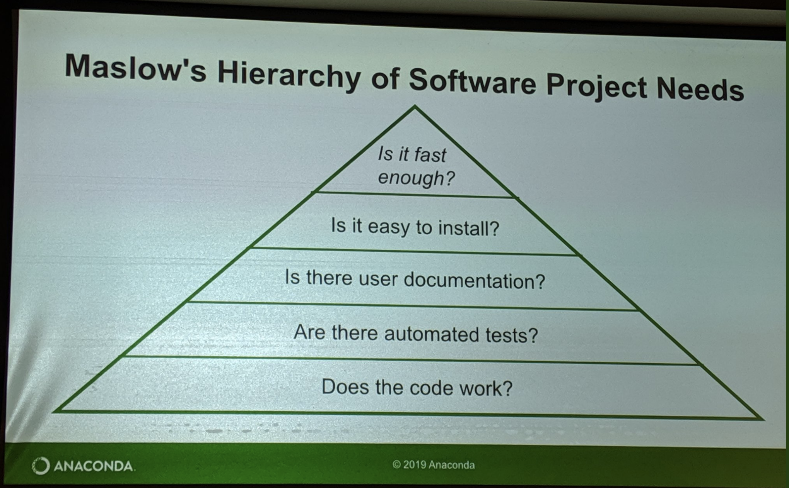

# Reflecting on SciPy 2019: My First SciPy, Definitely Not My Last

It's been a week since SciPy 2019 conference came to a close. I had the pleasure of speaking at SciPy 2019 about [**interactive supercomputing with Dask and Jupyter**](https://andersonbanihirwe.dev/talks/dask-jupyter-scipy-2019.html). I am so thankful for the chance to speak in the Earth, Ocean, Geo and Atmospheric Science track! Here's a recording of my talk:

<iframe width="100%" height="315" src="https://www.youtube.com/embed/vhawO8fgD64" frameborder="0" allow="autoplay; encrypted-media" allowfullscreen></iframe>

As I look back at my first [SciPy](https://www.scipy2019.scipy.org/), I can say that it was the most productive conference that I've been to so far. So, I wanted to take this opportunity to summarize my key takeaways.

## 1. The Awesomeness of SciPy Community

The biggest highlight of SciPy for me was the **community**.
**What an authentic, super-talented, enthusiastic and welcoming community!** I met and interacted with a lot of amazing people that I only knew via Github prior the conference :). The community is really what makes SciPy such a special conference.

## 2. Invisible Work in Open Source Software Projects

> Because so much of the work in OSS is tracked on public platforms, it is easy to forget about the work that takes place outside of them.

This quote by Stuart really hit home. For the last few months, I've become a core maintainer of a few projects, and one of the things I've learned so far as a user, a contributor to, and core maintainer of an open source project is that it's really important to recognize that the github repository does not fully represent a project. **There's quite a lot of crucial, untracked work that goes on in the background** such as:

> Credit: Karthik Ram: http://inundata.org/talks/sdss

You can watch the full key note here:

<iframe width="560" height="315" src="https://www.youtube.com/embed/PM3iltcaIL8" frameborder="0" allow="accelerometer; autoplay; clipboard-write; encrypted-media; gyroscope; picture-in-picture" allowfullscreen></iframe>

## 3. Tell People When You Appreciate Their Work

Another key lessons I learned is from [Carol Willing's keynote](https://www.youtube.com/watch?v=s-W-UvGgDco&list=PLYx7XA2nY5GcDQblpQ_M1V3PQPoLWiDAC&index=71) is that research shows that meeting someone who has befitted from your work can double your effort and triple your productivity:

> Credit: Carol Willing: https://speakerdeck.com/willingc/jupyter-always-open-for-learning-and-discovery

## 4. We Should Think About Open Source Standards

Matthew Rocklin gave a great talk on [refactoring the SciPy ecosystem for heterogeneous computing](http://matthewrocklin.com/slides/scipy-2019.html).

<iframe width="100%" height="315" src="https://www.youtube.com/embed/Q0DsdiY-jiw" frameborder="0" allow="accelerometer; autoplay; encrypted-media; gyroscope; picture-in-picture" allowfullscreen></iframe>

My takeaway from his talk is that

> The Python scientific community fractures when we develop competing packages that are not compatible with each other and thrives when we develop tools based on common standards.

As software developers, we should try to follow already existing standards when we can, because standards level the playing field in so many ways:

- new technologies can quickly compete
- new developers can quickly engage
- incentivize support (e.g. GitHub renders `.ipynb` since Jupyter notebooks are built on a widely used standard)

## 5. Jupyter Notebooks Come Alive with Jupyter Widgets

One of my favorite SciPy 2019 talks is Martin and Maarten's talk on **Dashboarding with Jupyter Notebooks, Voilà and Widgets**. It is really fun and full of cool stuffs.

<iframe width="100%" height="315" src="https://www.youtube.com/embed/VtchVpoSdoQ" frameborder="0" allow="accelerometer; autoplay; encrypted-media; gyroscope; picture-in-picture" allowfullscreen></iframe>

I am looking forward to making my own widgets and dashboards! And exclaiming **voilà!** after I deploy them!

## 6. Maslow’s Hierarchy of Software Needs

Stan's talk on **How to Accelerate an Existing Codebase with Numba** is also among my favorites. The Key lesson from this talk is the following:

> Be honest with yourself about where your project is in this hierarchy. If your program doesn't run, there's no point in making it faster.

> Credit: Stan Seibert

<iframe width="100%" height="315" src="https://www.youtube.com/embed/-4tD8kNHdXs" frameborder="0" allow="accelerometer; autoplay; encrypted-media; gyroscope; picture-in-picture" allowfullscreen></iframe>

## 7. Final Thoughts

I left SciPy 2019 feeling:

- **very thankful** that so many amazing people are able to come out and collaborate on the projects that are so vital to the Python scientific ecocystem!
- **grateful** to be part of this community.
- **inspired** to keep contributing to this community.
- **so excited** about the technology, the science, and the people.

**Thank you so much to the SciPy Conference organizers for putting on a great conference.**
