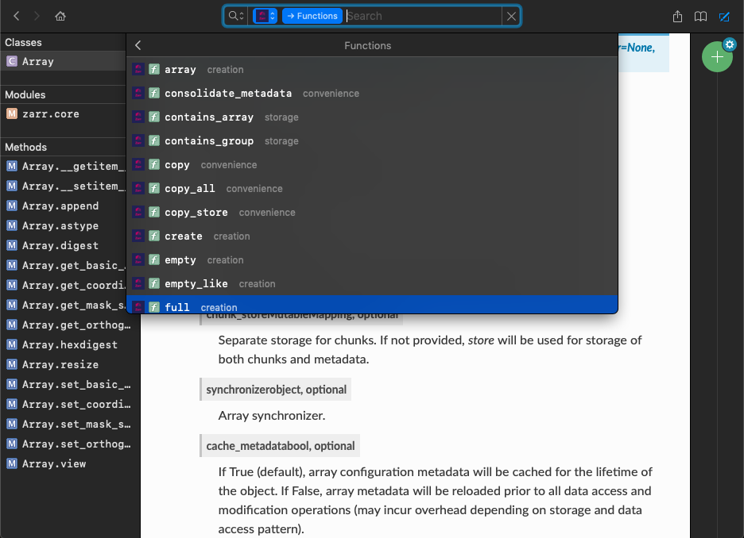
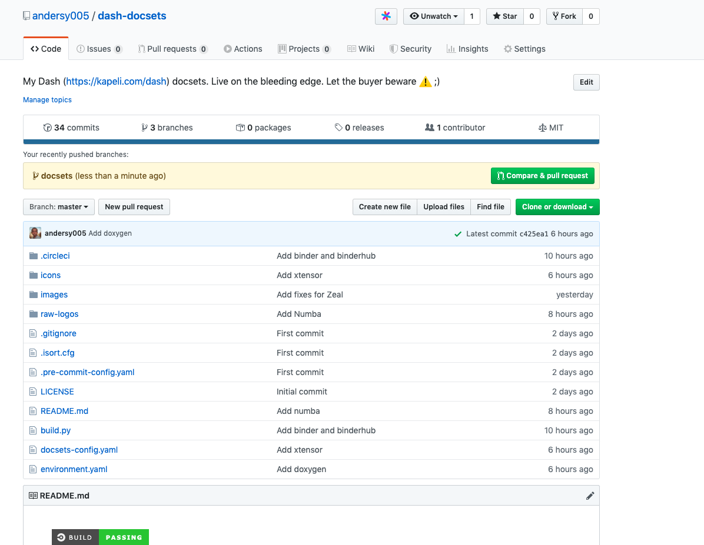
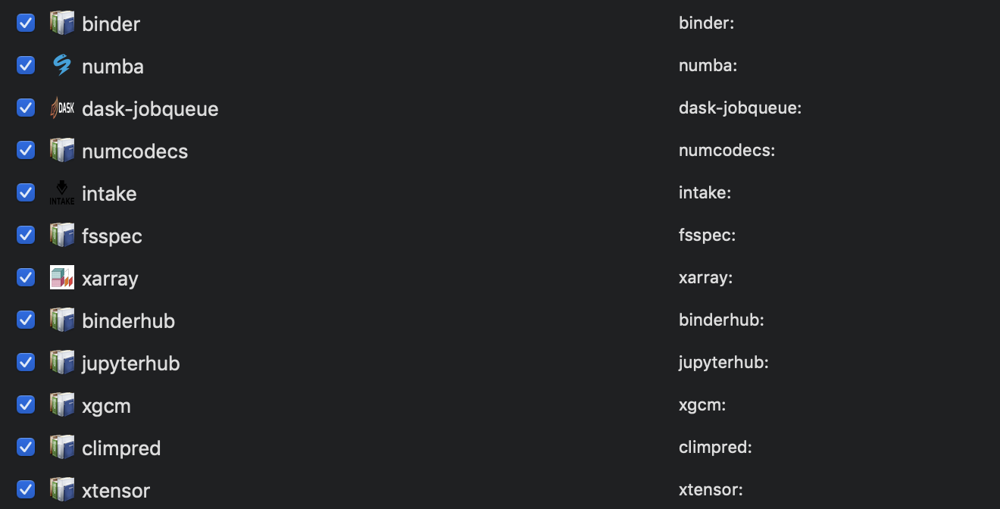

# A Knitting Weekend with Dash and Python

For the last few months, I've become a huge fan of the **quiet weekend**, the weekend when no plan is the plan, and you are in no hurry at all. I woke up on Saturday morning, and I decided that this weekend was going to be a quiet one. After watching a late morning football game from the English Premier League -- yup, I refuse to call it soccer 😀 -- I decided to write some code-nothing big, just a few lines of codes to improve my experience with [Dash](https://kapeli.com/dash), a tool that I've been using for a few months.

Dash is a MacOS application that offers offline documentation for hundreds of programming languages, frameworks and libraries. Dash is awesome for offline programming when using spotty WiFi or on long-haul flights. While it is **free as in beer**, it's one of the programs that are worth paying for.

## The Problem

I've been using Dash for quite some time and have been really satisfied with the preset selection of documentation sets. At some point, I started running into scenarios when I was using libraries/packages whose documentations aren't available for Dash. So, my objective was to generate documentation sets for these libraries myself. I should point out that I mostly work with Python packages, and most Python packages use [sphinx](https://www.sphinx-doc.org/) as their main framework for building documentation. So, my goal was to find a way to easily build documentation sets and integrate them with Dash.

## The Solution: Doc2dash and Sphinx To The Rescue

After few minutes of google searches, I found doc2dash. [doc2dash](https://doc2dash.readthedocs.io/en/stable/) is a great tool for converting HTML documentation to Dash's format. doc2dash takes the output of Sphinx documentation and converts it to a Dash documentation package.

### Show Me The Code!

In Just a few steps, I was able to build a docset for [Zarr](https://zarr.readthedocs.io/en/stable/) using dash2doc:

- Create new conda environment and install dependencies

  ```bash
  $ conda create -n dash-docs -c conda-forge \
       doc2dash sphinx-rtd-theme numpydoc sphinx-issues
  $ conda activate dash-docs
  ```

- Pull down the project form GitHub and build the documentation

  ```bash
  $ git clone https://github.com/zarr-developers/zarr-python.git
  $ cd zarr-python
  $ python -m pip install -e .
  $ cd docs
  $ make html
  ```

- Finally, run doc2dash with a few commands

  ```bash
  $ doc2dash --name zarr --index-page index.html --enable-js \
    --add-to-dash _build/html
  ```

  And with that I had a shiny new Zarr docset in Dash:

  

  Once I was confident that I understood how to do this for one project, I decided to automate this process for a bunch of other projects. By dinner time (on Saturday) I felt like I was on the right track. After a few more hours on Sunday and Monday, I had a [GitHub repository](https://github.com/andersy005/dash-docsets) with continuous integration via CircleCI up and running, and had a dozen docsets generated:

  

  

## Was It Worth Fifteen or Twenty Hours of My Life?

**I think so:** I took pleasure in doing something that I knew how to do and in creating something that would fit my needs perfectly.

Sitting in a chair in front a computer screen while listening to MIX 100 Denver Radio station 😀, I was reminded of the [intriguing parallels between knitting and programming](https://www.nytimes.com/2019/05/17/science/math-physics-knitting-matsumoto.html):

> "Knitting is Coding, and Yarn is a Programmable material."

_On quiet weekends like this I write code for fun, and Visual Studio Code & Python are my yarn and needles._
