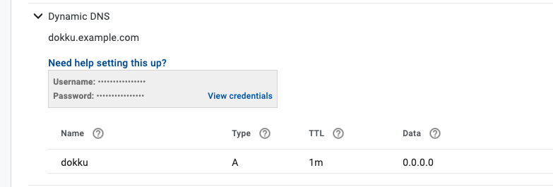
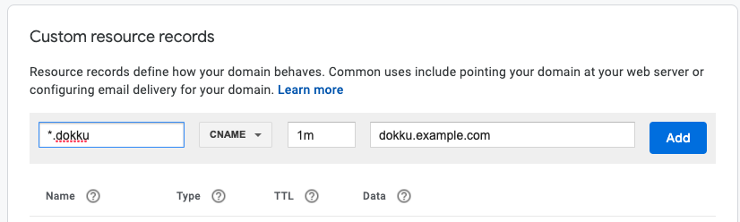

# How to set up a wildcard subdomain on Google Domains

Today, I was working with [dokku](https://github.com/dokku/dokku/), and I found myself in need of a wildcard subdomain. A [wildcard DNS record](https://en.wikipedia.org/wiki/Wildcard_DNS_record) is a record that will match requests for non-existent subdomains. For instance, if you set a wildcard DNS record to `*.example.com`, if a user requests `random.example.com` or `foo.example.com`, etc.. the requests will be forwarded to whichever server `*.example.com` points to.

For my use case, I wanted to host multiple applications on a single server, and wanted to map each app to a subdomain such as `app1-name.dokku.example.com`, `app2-name.dokku.example.com`, etc. To achieve this, I needed to set up a wildcard DNS record for `*.dokku.example.com`.

Currently, I happen to own a domain on [Google Domains](https://domains.google/). Below are the steps I followed to set up the `*.dokku.example.com` wildcard DNS record.

:::{note}
I'm using `example.com` as a dummy domain for demonstration purposes.
:::

## Step 1: Create a Dynamic DNS record in Synthetic Records

Create a synthetic record for **dokku.example.com** instead of **\*.dokku.example.com**:



## Step 2: Create a CNAME record of the subdomain

Create a CNAME record of the subdomain **\*dokku.example.com** and point it to the synthetic records subdomain **dokku.example.com**:



## Step 3: Set up ddclient on your server

First, make sure [`ddclient`](https://github.com/ddclient/ddclient) is installed on your server and the `ddclient` service is up and running.

Second,

```bash
$ sudo nano /etc/ddclient.conf
```

And edit these lines using the credentials from the created Google Domains dynamic DNS record:

```bash
##
## Google Domains (www.google.com/domains)
##
# protocol=googledomains,
# login=my-auto-generated-username,
# password=my-auto-generated-password
# my.domain.tld, otherhost.domain.tld
```

- Example:

```bash
daemon=3600 # Check every 1 hour
ssl=yes
use=web, web=checkip.dyndns.com/, web-skip='IP Address'
protocol=googledomains
login=xxzzzxxxxxxzzzzzz
password=xxzzzzxxxxzzzzz
dokku.example.com
```

Verify that the `ddclient` is working by trying:

```bash
sudo ddclient -daemon=0 -debug -verbose -noquiet
```

## Step 4: Verify that our changes have taken effect

We can verify our changes on a UNIX machine by trying one or more of the following commands:

- `host dokku.example.com`
- `dig dokku.example.com`
- `nslookup dokku.example.com`

Once we have a confirmation that our top level subdomain works, we should be able to query any other name under `dokku.example.com` and get back an IP address of our server. Try:

- `host myapp.dokku.example.com`
- `dig +short '*.dokku.example.com'`

Credits: Thank you [StackExchange](https://serverfault.com/questions/670066/google-dynamic-dns-wildcard-subdomains) 🙏🏽!
